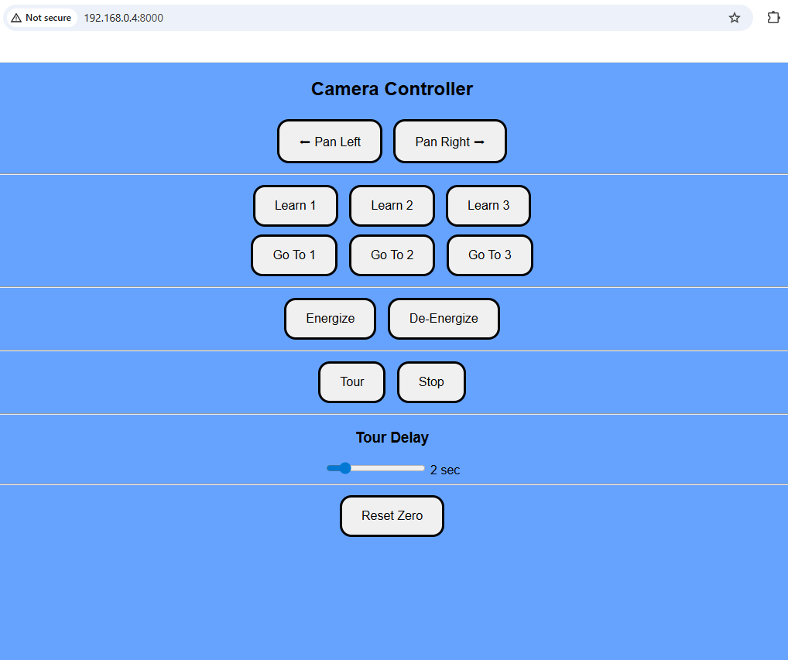

# 📷 Camera Controller – Raspberry Pi + Pololu Tic T825


Web-based controller for a stepper motor powered camera pan rig using a **Pololu Tic T825 USB stepper controller**, **NEMA 17 stepper motor**, and a **Raspberry Pi**. This project provides a clean browser interface to control camera motion, store presets, and run automated cinematic pan tours.

## 🚀 Features

- Pan left / right motor control  
- Save and recall camera position presets  
- Automated tour mode  
- Adjustable tour delay slider (cinematic pacing)  
- Motor energize / de-energize toggle  
- Reset zero position  
- USB communication with Pololu Tic controller  
- Web UI accessible from any device on your network  

## 🧩 Hardware Requirements

### ✅ Required Components

| Component | Description |
|-----------|------------|
| Raspberry Pi | Pi 3, Pi 4, or Pi Zero 2 W (recommended) |
| Stepper Controller | Pololu Tic T825 USB Stepper Motor Controller |
| Stepper Motor | NEMA 17 Bipolar Stepper Motor (92 oz-in torque) |
| Power Supply | 24V DC Power Adapter (2A recommended) |
| USB Cable | Micro USB (Pi → Pololu Tic) |
| Camera Mount | Pan mount or tripod head (user choice) |

## 🔗 Example Hardware Links

### ▶ NEMA 17 Stepper Motor (92 oz-in)

- 1.8° step angle  
- Bipolar 4-wire motor  
- High torque for camera rigs  

Example:  
https://www.amazon.com/dp/B00PNEQUZ2  

### ▶ Pololu Tic T825 Stepper Controller

Features:

- USB interface  
- Up to 2.5A motor current  
- Hardware acceleration  
- Microstepping support  
- Python control via `ticlib`  

Product Page:  
https://www.pololu.com/product/3131  

### ▶ 24V Power Supply

Recommended:

- 24V DC output  
- Minimum 2A current  
- Center-positive barrel jack  

Example:  
https://www.amazon.com/dp/B07VL8W6MQ  

⚠ **IMPORTANT:**  
The stepper motor is powered by the **24V supply**, NOT the Raspberry Pi.

## 🔧 Wiring Overview

### Stepper Motor → Pololu Tic

Connect the NEMA 17 motor wires to:

- A+  
- A-  
- B+  
- B-  

(Check motor datasheet to identify coil pairs)

### Power Supply → Pololu Tic

- Power adapter positive → VIN  
- Power adapter ground → GND  

### Raspberry Pi → Pololu Tic

Connect using **Micro USB cable**, which provides:

- USB communication  
- Controller logic power  

## 🖥 Software Requirements

- Raspberry Pi OS (or any Linux distro)  
- Python 3.9+  
- Internet access (for installation)  

### Python Dependencies

- fastapi  
- uvicorn  
- ticlib  
- pyusb  

## 📦 Installation and Setup

Clone the repository:

```bash
git clone https://github.com/joelchicas/camera-controller.git
cd camera-controller/backend

### Install Python Packages:

- pip install -r requirements.txt
- sudo apt install libusb-1.0-0-dev


### Verify Pololu Tic Connection:

- ticcmd --status

### Start Web Server:

- python3 uvicorn main:app --host 0.0.0.0 --port 8000

### Open Web Interface from another device on your network:

- http://YOUR-RASPI-IP-ADDR:8000

```

### Optional: Install as a System Service (Start on Boot)

```bash
### Copy the service file

- sudo cp ~/camera-controller/systemd/camera-controller.service /etc/systemd/system/

### Reload systemd

- sudo systemctl daemon-reexec
- sudo systemctl daemon-reload

### Enable the service for your user

- sudo systemctl enable camera-controller@$(whoami).service

### Start it immediately

- sudo systemctl start camera-controller@$(whoami).service

### Verify Service Status

- systemctl status camera-controller@$(whoami).service

### Access the Web Interface

- http://YOUR-RASPBERRY-PI-IP:8000

```
